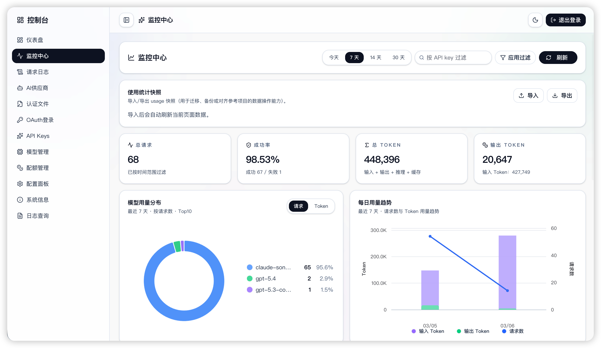
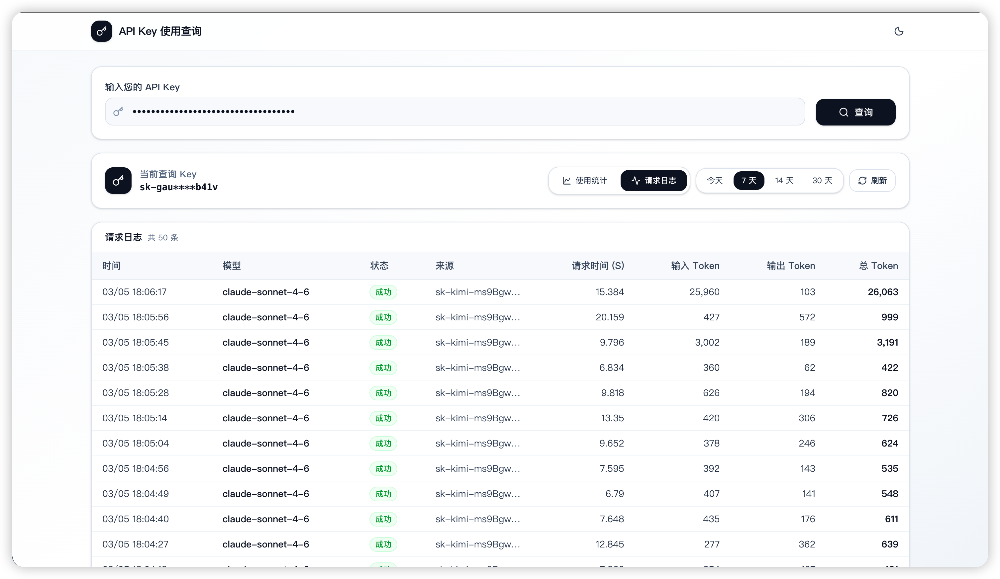

<p align="center">
  
  
  
  
</p>

<h1 align="center">🔀 CliRelay</h1>

<p align="center">
  <strong>A unified proxy server for AI CLI tools — use your <em>existing</em> subscriptions with any OpenAI / Gemini / Claude / Codex compatible client.</strong>
</p>

<p align="center">
  English | <a href="README_CN.md">中文</a>
</p>

<p align="center">
  <a href="https://help.router-for.me/">📖 Docs</a> ·
  <a href="https://github.com/kittors/codeProxy">🖥️ Management Panel</a> ·
  <a href="https://github.com/kittors/CliRelay/issues">🐛 Report Bug</a> ·
  <a href="https://github.com/kittors/CliRelay/pulls">✨ Request Feature</a>
</p>

---

## ⚡ What is CliRelay?

CliRelay lets you **proxy requests** from AI coding tools (Claude Code, Gemini CLI, OpenAI Codex, Amp CLI, etc.) through a single local endpoint. Authenticate once with OAuth, add your API keys — or both — and CliRelay handles the rest:

```
┌───────────────────────┐         ┌──────────────┐         ┌────────────────────┐
│   AI Coding Tools     │         │              │         │  Upstream Providers │
│                       │         │              │ ──────▶ │  Google Gemini      │
│  Claude Code          │ ──────▶ │   CliRelay   │ ──────▶ │  OpenAI / Codex    │
│  Gemini CLI           │         │   :8317      │ ──────▶ │  Anthropic Claude  │
│  OpenAI Codex         │         │              │ ──────▶ │  Qwen / iFlow      │
│  Amp CLI / IDE        │         │              │ ──────▶ │  OpenRouter / ...  │
│  Any OAI-compatible   │         └──────────────┘         └────────────────────┘
└───────────────────────┘
```

## ✨ Highlights

| Feature | Description |
|:--------|:------------|
| 🔌 **Multi-Provider** | OpenAI, Gemini, Claude, Codex, Qwen, iFlow, Vertex, and any OpenAI-compatible upstream |
| 🔑 **OAuth & API Keys** | Log in via browser OAuth *or* paste API keys — works with both |
| ⚖️ **Load Balancing** | Round-robin / fill-first across multiple accounts per provider |
| 🔄 **Auto Failover** | Smart quota-exceeded handling with project & model fallback |
| 🖥️ **Management Panel** | Built-in web UI for monitoring, config, and usage stats — [codeProxy](https://github.com/kittors/codeProxy) |
| 🧩 **Go SDK** | Embed the proxy in your own Go application |
| 🛡️ **Security** | API key auth, TLS, localhost-only management, request cloaking |
| 🎯 **Model Mapping** | Route unavailable models to alternatives automatically |
| 🌊 **Streaming** | Full SSE streaming & non-streaming with keep-alive support |
| 🧠 **Multimodal** | Text + image inputs, function calling / tools |

## 🚀 Quick Start

### 1️⃣ Download & Configure

```bash
# Download the latest release for your platform from GitHub Releases
# Then copy the example config
cp config.example.yaml config.yaml
```

Edit `config.yaml` to add your API keys or OAuth credentials.

### 2️⃣ Run

```bash
./clirelay
# Server starts at http://localhost:8317
```

### 🐳 Docker

```bash
docker compose up -d
```

### 3️⃣ Point Your Tools

Set your AI tool's API base to `http://localhost:8317` and start coding!

**Example: OpenAI Codex (`~/.codex/config.toml`)**
```toml
[model_providers.tabcode]
name = "openai"
base_url = "http://localhost:8317/v1"
requires_openai_auth = true
```

> 📖 **Full setup guides →** [help.router-for.me](https://help.router-for.me/)

## 🖥️ Management Panel

The **[codeProxy](https://github.com/kittors/codeProxy)** frontend provides a modern management dashboard for CliRelay:

- 📊 Real-time usage monitoring & statistics
- ⚙️ Visual configuration editing
- 🔐 OAuth provider management
- 📋 Structured log viewer

<details>
<summary>📸 Dashboard Screenshots</summary>

<p align="center">
  
  
</p>
<p align="center">
  
  
</p>
</details>

```bash
# Clone and start the management panel
git clone https://github.com/kittors/codeProxy.git
cd codeProxy
bun install
bun run dev
# Visit http://localhost:5173
```

## 🏗️ Supported Providers

<table>
<tr>
<td align="center"><strong>🟢 Google Gemini</strong><br/>OAuth + API Key</td>
<td align="center"><strong>🟣 Anthropic Claude</strong><br/>OAuth + API Key</td>
<td align="center"><strong>⚫ OpenAI Codex</strong><br/>OAuth</td>
</tr>
<tr>
<td align="center"><strong>🔵 Qwen Code</strong><br/>OAuth</td>
<td align="center"><strong>🟡 iFlow (GLM)</strong><br/>OAuth</td>
<td align="center"><strong>🟠 Vertex AI</strong><br/>API Key</td>
</tr>
<tr>
<td align="center" colspan="3"><strong>🔗 Any OpenAI-compatible upstream</strong> (OpenRouter, etc.)</td>
</tr>
</table>

## 📐 Architecture

```
CliRelay/
├── cmd/              # Entry point
├── internal/         # Core proxy logic, translators, handlers
├── sdk/              # Reusable Go SDK
├── auths/            # Authentication flows
├── examples/         # Custom provider examples
├── docs/             # SDK & API documentation
├── config.yaml       # Runtime configuration
└── docker-compose.yml
```

## 📚 Documentation

| Doc | Description |
|:----|:------------|
| [Getting Started](https://help.router-for.me/) | Full installation and setup guide |
| [Management API](https://help.router-for.me/management/api) | REST API reference for management endpoints |
| [Amp CLI Guide](https://help.router-for.me/agent-client/amp-cli.html) | Integrate with Amp CLI & IDE extensions |
| [SDK Usage](docs/sdk-usage.md) | Embed the proxy in Go applications |
| [SDK Advanced](docs/sdk-advanced.md) | Executors & translators deep-dive |
| [SDK Access](docs/sdk-access.md) | Authentication in SDK context |
| [SDK Watcher](docs/sdk-watcher.md) | Credential loading & hot-reload |

## 🌍 Ecosystem

Projects built on top of CliRelay:

| Project | Platform | Description |
|:--------|:---------|:------------|
| [vibeproxy](https://github.com/automazeio/vibeproxy) | macOS | Menu bar app for Claude Code & ChatGPT subscriptions |
| [Subtitle Translator](https://github.com/VjayC/SRT-Subtitle-Translator-Validator) | Web | SRT subtitle translator powered by Gemini |
| [CCS](https://github.com/kaitranntt/ccs) | CLI | Instant switching between multiple Claude accounts |
| [ProxyPal](https://github.com/heyhuynhgiabuu/proxypal) | macOS | GUI for managing providers & endpoints |
| [Quotio](https://github.com/nguyenphutrong/quotio) | macOS | Unified subscription management with quota tracking |
| [CodMate](https://github.com/loocor/CodMate) | macOS | SwiftUI app for CLI AI session management |
| [ProxyPilot](https://github.com/Finesssee/ProxyPilot) | Windows | Windows-native fork with TUI & system tray |
| [Claude Proxy VSCode](https://github.com/uzhao/claude-proxy-vscode) | VSCode | Quick model switching with built-in backend |
| [ZeroLimit](https://github.com/0xtbug/zero-limit) | Windows | Tauri + React quota monitoring dashboard |
| [CPA-XXX Panel](https://github.com/ferretgeek/CPA-X) | Web | Admin panel with health checks & request stats |
| [CLIProxyAPI Tray](https://github.com/kitephp/CLIProxyAPI_Tray) | Windows | PowerShell-based tray app with auto-update |
| [霖君 (LinJun)](https://github.com/wangdabaoqq/LinJun) | Cross-platform | Desktop app for managing AI coding assistants |
| [CLIProxyAPI Dashboard](https://github.com/itsmylife44/cliproxyapi-dashboard) | Web | Next.js dashboard with real-time logs & config sync |

**Inspired by CliRelay:**

| Project | Description |
|:--------|:------------|
| [9Router](https://github.com/decolua/9router) | Next.js implementation with combo system & auto-fallback |
| [OmniRoute](https://github.com/diegosouzapw/OmniRoute) | AI gateway with smart routing, caching & observability |

> [!NOTE]
> Built something with CliRelay? Open a PR to add it here!

## 🤝 Contributing

Contributions are welcome! Here's how to get started:

```bash
# 1. Fork & clone
git clone https://github.com/<your-username>/CliRelay.git

# 2. Create a feature branch
git checkout -b feature/amazing-feature

# 3. Make your changes & commit
git commit -m "feat: add amazing feature"

# 4. Push & open a PR
git push origin feature/amazing-feature
```

## 📜 License

This project is licensed under the **MIT License** — see the [LICENSE](LICENSE) file for details.

---

<p align="center">
  <sub>Made with ❤️ by the CliRelay community</sub>
</p>
